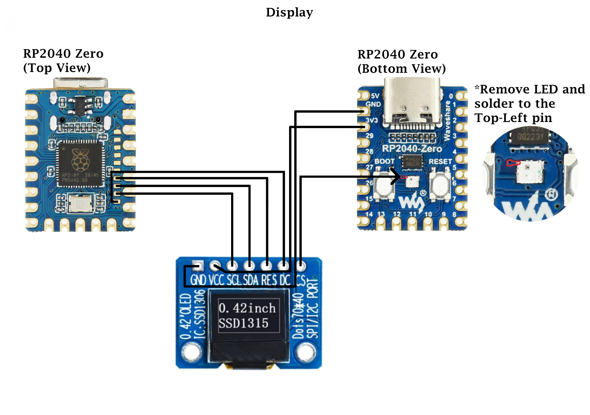
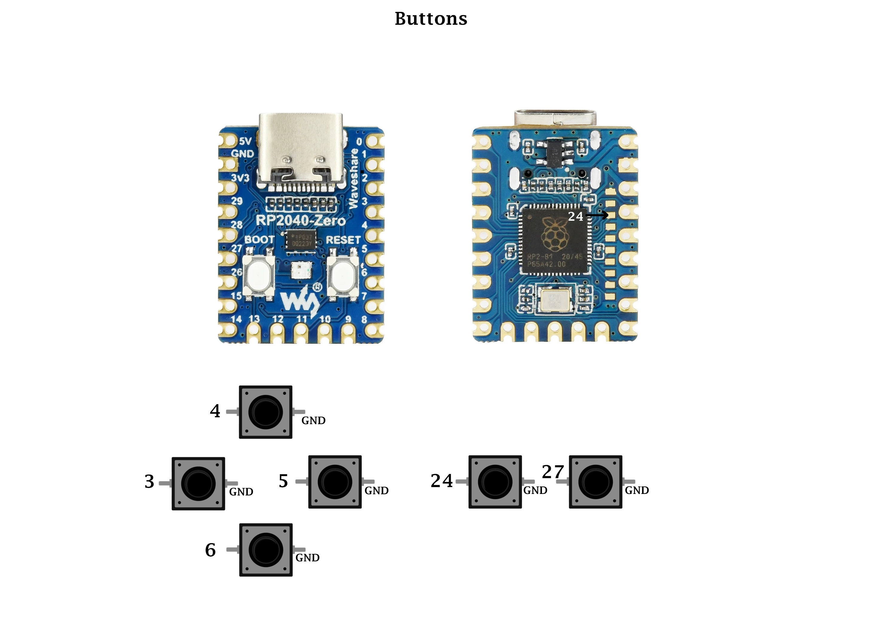
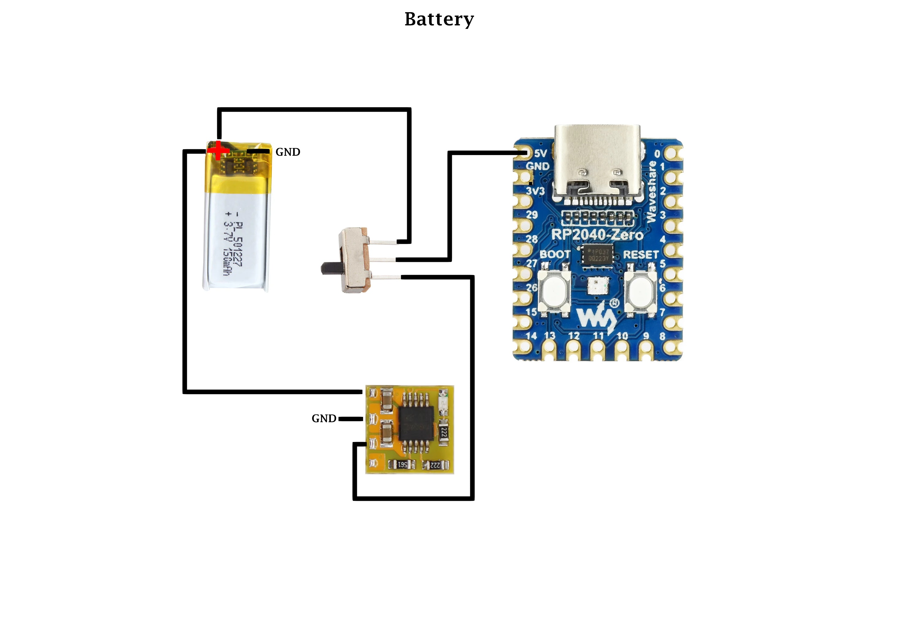

# RP2040 Doom




This is a fork of RP2040 Doom targeting the Thumby. It switches the display between different contrast levels fast enough to generate
pretty reasonable greyscale. Sound is currently unsupported. It doesn't overclock the device like the VGA version.

Different batches have slightly different displays. If you get a display that doesn't sync, or doesn't do the greyscale trick, try
fiddling with the `FRAME_PERIOD` in `i_video.c`. The settings here work on the Thumby I have, but [other](https://www.youtube.com/watch?v=o76U0JPrMFk)
[devices](https://www.youtube.com/watch?v=-G9adESjjRg) have sometimes needed a frame period of around 6400, and `PARK_LINES` of 2.

## Controls

D-pad moves, top button is fire. The bottom button is run, strafe and use, and in combination with d-pad down, switches weapon.
You're not actually intending to play this, though?


## Building

Most of the details are in the original readme below. Briefly:

install pico-sdk, pico-extras & their requisites. You'll also need picotool to install the Doom wad.

```bash
mkdir thumby-build
cd thumby-build
cmake -DCMAKE_BUILD_TYPE=MinSizeRel -DPICO_BOARD=jthumby -DPICO_SDK_PATH=/path/to/pico-sdk -DPICO_EXTRAS_PATH=/path/to/pico-extras ..
```

Then `make` to make `doom_tiny.uf2`.

To install it on the Thumby, you'll need to boot into BOOTSEL mode. Turn it off, then hold the down button on the dpad while turning it
on. It should pop up as a flash drive on your computer.

Copy `doom_tiny.uf2` to that flash drive. (This will delete everything on your Thumby! If you ever want to not play Doom on it, you'll
have to follow the same process to reinstall its original firmware, and download all your games again.)

Finally, you need to install the Doom data on it. Boot the Thumby into BOOTSEL mode again, and run

```bash
picotool load -v -t bin doom1.whx -o 0x10040000.
```

Turn it off and on again.

[](https://youtu.be/k7ztqNAVVsY)


## Development

You can build a version that simulates the 72x40 glory on your PC.

```bash
./cup.sh <whd/whx_file>
mkdir host-build
cd host-build
cmake -DPICO_PLATFORM=host -DPICO_SDK_PATH=/path/to/pico-sdk -DPICO_EXTRAS_PATH=/path/to/pico-extras -DPICO_SDK_PRE_LIST_DIRS=/path/to/pico_host_sdl ..
make
```


#
#

# Original README:


This is a port of Doom for RP2040 devices, derived from [Chocolate Doom](https://github.com/chocolate-doom/chocolate-doom).

Significant changes have been made to support running on the RP2040 device, but particularly to support running the 
entire shareware `DOOM1.WAD` which is 4M big on a Raspberry Pi Pico with only 2M flash!

You can read many details on this port in the blog post [here](https://kilograham.github.io/rp2040-doom/).

Note that a hopefully-fully-functional `chocolate-doom` executable is buildable from this RP2040 code base as a 
means of 
verification that everything still works, but whilst they can still be built, Hexen, Strife and Heretic are almost 
certainly broken, so are not built by default.

This chocolate-doom commit that the code is branched off can be found in the `upstream` branch.

The original Chocolate Doom README is [here](README-chocolate.md).

## Code State

Thus far, the focus has been entirely on getting RP2040 Doom running. Not a lot of time has been 
spent 
cleaning 
the code up. There are a bunch of defunct `#ifdefs` and other code that was useful at some point, 
but no longer are, and indeed changing them may result in non-functional code. This is particularly 
true of 
the 
`whd_gen` tool 
used to 
convert/compress WADs 
who's code is 
likely completely incomprehensible!  

## Artifacts

You can find a RP2040 Doom UF2s based on the standard VGA/I2S pins in the 
releases of this repository. There are also versions with the shareware DOOM1.WAD already embedded.

Note you can always use `picotool info -a <UF2 file>` to see the pins used by a particular build.

## Goals

The main goals for this port were:

1. Everything should match the original game experience, i.e. all the graphics at classic 320x200 resolution, stereo
   sound,
   OPL2 music, save/load, demo playback, cheats, network multiplayer... basically it should feel like the original game.
2. `DOOM1.WAD` should run on a Raspberry Pi Pico. There was also to be no sneaky discarding of splash screens, altering of levels, down-sampling of
   textures or whatever. RP2040 boards with 8M should be able to play at least the full *Ultimate Doom* and *DOOM II*
   WADs.
3. The RP2040 should output directly to VGA (16 color pins for RGB565 along with HSync/VSync) along with stereo sound.

## Results

[](https://youtu.be/eDVazQVycP4)

Features:

* Full `DOOM1.WAD` playable on Raspberry Pi Pico with 2M flash.
* *Ultimate Doom* and *Doom II* are playable on 8M devices.
* 320x200x60 VGA output (really 1280x1024x60).
* 9 Channel OPL2 Sound at 49716Hz.
* 9 Channel Stereo Sound Effects.
* I2C networking for up to 4 players.
* Save/Load of games.
* All cheats supported.
* Demos from original WADs run correctly.
* USB Keyboard Input support.
* All end scenes, intermissions, help screens etc. supported.
* Good frame rate; generally 30-35+ FPS.
* Uses 270Mhz overclock (requires flash chip that will run at 135Mhz)

# Building

RP2040 Doom should build fine on Linux and macOS. The RP2040 targeting builds should also work on Windows, though I 
haven't tried.

The build uses `CMake`.

## Regular chocolate-doom/native builds

To build everything, assuming you have SDL2 dependencies installed, you can create a build directory:

```bash
mkdir build
cd build
cmake ..
```

And then run `make` or `make -j<num_cpus>` from that directory. To build a particular target e.g. `chocolate-doom`, 
do `make chocolate-doom`

Note this is the way you build the `whd_gen` tool too.

## RP2040 Doom builds

You must have [pico-sdk](https://github.com/raspberrypi/pico-sdk) and 
**the latest version of** [pico-extras](https://github.com/raspberrypi/pico-extras) installed, along with the regular 
pico-sdk requisites (e.g.
`arm-none-eabi-gcc`). If in doubt, see the Raspberry Pi
[documentation](https://datasheets.raspberrypi.com/pico/getting-started-with-pico.pdf). I have been building against 
the `develop` branch of `pico-sdk`, so I recommend that..

**NOTE: I was building with arm-none-eabi-gcc 9.2.1 .. it seems like other versions may cause problems with binary 
size, so stick with that for now.** 

For USB keyboard input support, RP2040 Doom currently uses a modified version of TinyUSB included as a submodule. 
Make sure you have initialized this submodule via `git submodule update --init` 

You can create a build directly like this:

```bash
mkdir rp2040-build
cd rp2040-build
cmake -DCMAKE_BUILD_TYPE=MinSizeRel -DPICO_BOARD=vgaboard -DPICO_SDK_PATH=/path/to/pico-sdk -DPICO_EXTRAS_PATH=/path/to/pico-extras ..
```

Note that the `PICO_BOARD` setting is for the standard VGA demo board which has RGB on pins 0->15, sync pins on 16,17 
and 
I2S on 26,27,28.

As before, use `make` or `make <target>` to build. 

The RP2040 version has four targets, each of which create a similarly named `UF2` file (e.g. `doom_tiny.uf2`). 
These UF2 files contain the executable code/data, but they do not contain the WAD data which is converted into a 
RP2040 Domom 
specific WHD/WHX format by `whd_gen` (for more see below). The WHD/WHX file must also be loaded onto the device at a 
specific address which varies by binary. 

"super-tiny" refers to RP2040 Doom builds that use the more compressed WHX format, and 
required for`DOOM1.
WAD` to 
run 
on a 2M Raspberry Pi Pico. "Non super-tiny" refers to RP2040 Doom builds that use the WHD format which is larger, but 
also is 
required for *Ultimate Doom* and *Doom II* WADs. These binaries are distinct as supporting both formats in the same 
binary would just have made things bigger and slower.


* **doom_tiny** This is a "super tiny" version with no USB keyboard support. You can use
[SDL Event Forwarder](https://github.com/kilograham/sdl_event_forwarder) to tunnel keyboard input from your host 
  computer over UART. The WHX file must be loaded at `0x10040000`. 
* **doom_tiny_usb** This is a "super tiny" version with additional USB keyboard support. Because of the extra USB 
  code, the WHX file must be loaded at `0x10042000`. As you can see USB support via TinyUSB causes the binary to 
  grow by 2K (hence the move of the WHX file address) leaving less space for saved games (which are also stored in 
  flash).
* **doom_tiny_nost** This is a "non super tiny" version of `doom_tiny` supporting larger WADs stored as WHD. The WHD 
  file must be loaded at `0x10048000`
* **doom_tiny_nost_usb** This is a "non super tiny" version of `doom_tiny_usb` supporting larger WADs stored as 
  WHD. The WHD
  file must be loaded at `0x10048000`

You can load you WHD/WHX file using [picotool](https://github.com/raspberrypi/picotool). e.g.

```bash
picotool load -v -t bin doom1.whx -o 0x10042000.
```

See `whd_gen` further below for generating `WHX` or `WHD` files.

#### USB keyboard support

Note that TinyUSB host mode support for keyboard may not work with all keyboards especially since the RP2040 Doom 
has been built with small limits for number/sizes of hubs etc. I know that Raspberry Pi keyboards work fine, as 
did my ancient 
Dell keyboard. Your keyboard may just do nothing, or may cause a crash. If so, for now, you are stuck forwarding 
keys from another PC via sdl_event_forwarder.

### RP2040 Doom builds not targeting an RP2040 device

You can also build the RP2040 Doom to run on your host computer (Linux or macOS) by using
[pico_host_sdl](https://github.com/raspberrypi/pico-host-sdl) which simulates RP2040 based video/audio output using SDL.

This version currently embeds the WHD/WHX in `src/tiny.whd.h` so you must generate this file.

You can do this via `./cup.sh <whd/whx_file>`

```bash
mkdir host-build
cd host-build
cmake -DPICO_PLATFORM=host -DPICO_SDK_PATH=/path/to/pico-sdk -DPICO_EXTRAS_PATH=/path/to/pico-extras -DPICO_SDK_PRE_LIST_DIRS=/path/to/pico_host_sdl ..
```

... and then `make` as usual.

## whd_gen

`doom1.whx` is includd in this repository, otherwise you need to build `whd_gen` using the regular native build 
instructions above.

To generate a WHX file (you must use this to convert DOOM1.WAD to run on a 2M Raspberry Pi Pico)

```bash
whd_gen <wad_file> <whx_file>
```

The larger WADs (e.g. *Ultimate Doom* or *Doom II* have levels which are too complex to convert into a super tiny 
WHX file. These larger WADs are not going to fit in a 2M flash anywy, so the less compressed WHD format can be used 
given that the device now probably has 8M of flash.

```bash
whd_gen <wad_file> <whd_file> -no-super-tiny
```

Note that `whd_gen` has not been tested with a wide variety of WADs, so whilst it is possible that non Id WADs may 
work, it is by no means guaranteed!

NOTE: You should use a release build of `whd_gen` for the best sound effect fidelity, as the debug build 
deliberately lowers the encoding quality for the sake of speed.

# Running the RP2040 version

The releases here use pins as defined when building with `PICO_BOARD=vgaboard`:

```
 0-4:    Red 0-4
 6-10:   Green 0-4
 11-15:  Blue 0-4
 16:     HSync
 17:     VSync
 18:     I2C1 SDA
 19:     I2C1 SCL
 20:     UART1 TX
 21:     UART1 RX
 26:     I2S DIN
 27:     I2S BCK
 28:     I2S LRCK
```
You can always find these from your ELF or UF2 with 

```
picotool info -a <filename>
``` 

These match for example the Pimoroni Pico VGA Demo Base which itself is based on the suggested 
Raspberry Pi Documentation [here](https://datasheets.raspberrypi.com/rp2040/hardware-design-with-rp2040.pdf)
and the design files zipped [here](https://datasheets.raspberrypi.com/rp2040/VGA-KiCAD.zip).

# Future

*Evilution* and *Plutonia* are not yet supported. There is an issue tracking it 
[here](https://github.com/kilograham/rp2040-doom/issues/1).

# RP2040 Doom Licenses

* Any code derived from chocolate-doom matinains its existing license (generally GPLv2). 
* New RP2040 Doom specific code not implementing existing chocolate-doom interfaces is licensed BSD-3.
* ADPCM-XA is unmodified and is licensed BSD-3.
* Modified emu8950 derived code retains its MIT license.

